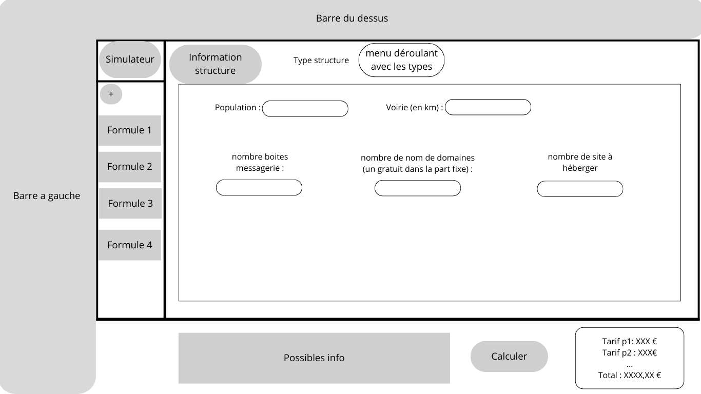

# Cahier des charges du simulateur de prix d'adhésions à l'ATD16

## Problème actuel

Il est difficile, voire même impossible, actuellement de simuler certaines adhésions pour des structures déjà adhérentes, de plus il est impossible de simuler le prix d'une nouvelle adhésion pour une structure pas encore adhérente, c'est à dire une structure pas enregistrée en base de données.

### Projet

Le but de ce projet serait de développer un simulateur qui calculerait le tarif d'une, ou plusieurs, nouvelle(s) adhésion(s) en rentrant les informations nécessaires au calcul. Ce qui permettra aux agents de calculer le prix d'une adhésion pour une structure, c'est une fonctionnalité qui améliorerait la visibilité sur les prix des adhésions pour les agents.

### Contexte

Ce simulateur devra s'intégrer à l'application déjà existante : **Numérobis**, il sera accessible sur le site de cette application et utilisera la même API, le simulateur sera donc utilisé par les membres de l'atd16.

### Expression fonctionnelle du besoin

| Type Fonction | Fonction                                                    | Critères d'appréciation                                                              | Coefficient |
| :-----------: | ----------------------------------------------------------- | ------------------------------------------------------------------------------------ | :---------: |
|      FP       | Calculer le prix final en fonction des adhésions simulées   | Renvoie le prix correct en un temps raisonnable                                      |      5      |
|      FC1      | Intégré sur le site interne                                 | Lien facilement trouvable sur le site                                                |      5      |
|      FC2      | Utilisé l'API **Numérobis** déjà existante                  | La/les nouvelles routes n'explosent pas l'API                                        |      5      |
|      FC3      | Formulaire intuitif et facilement completable               | Formulaire d'une taille raisonnable                                                  |      3      |
|      FC4      | Pouvoir facilement supprimer une politique de la simulation | Facilement supprimable sans supprimé les autres                                      |      3      |
|      FC5      | Faire attention aux prix planchers/plafonds                 | Aucun résultat de dépasse le plancher/plafond                                        |      5      |
|      FS1      | Pouvoir simulé le prix avec **plusieurs** politiques        | Résultats correct et toujours dans un temps modéré + détail des prix                 |      5      |
|      FS2      | Nouvelle page                                               | Page fonctionnelle pour le simulateur                                                |      3      |
|      FS3      | Notifier les différente réductions/augmentations            | Prendre en compte le volet multi-site ainsi que les réductions sur la cyber-sécurité |      2      |
|      FS4      | Notifier quand on atteint le plancher/plafond               | Notification que c'est un prix plafond/plancher                                      |      1      |

### Solutions proposées

#### Nouvelle Page

Je souhaite faire une page entière dédiée au simulateur, page contentant le formulaire ainsi que le choix de politique à simuler, et aussi le résultat et tout autre notification sur le calcul comme le plafond/plancher et augmentation/réduction

##### Wireframe




##### Intégration dans le site

Cette page devrait être accessible depuis la barre de navigation a gauche afin qu'elle soit accessible de puis n'importe où (et peut être aussi depuis la déjà présente simulation pour une structures déjà présente ?)

#### Back-End

Il faudra certainement ajouté une route POST dans l'api qui attendrai dans le body une structure ainsi que les politiques (ou en tout cas des infos pour créer une structure factice dans le back-end) et donc renvoyé le prix que coûterait toutes ces adhésions mais aussi le prix unitaire de chaque politique.

##### Formatage des données

```json
{
  "parameters": {
    "population": 853,
    "roads": 12.45,
    "etp": 0,
    "mailBox": 0,
    "domainName": 0,
    "hostingSite": 0
  },
  "formules": ["uri formule1", "uri formule2"]
}
```

Retour :

```json
{
  "simulatedPrice": 0.0,
  "formulesPrices": [0, 0, 0]
}
```
